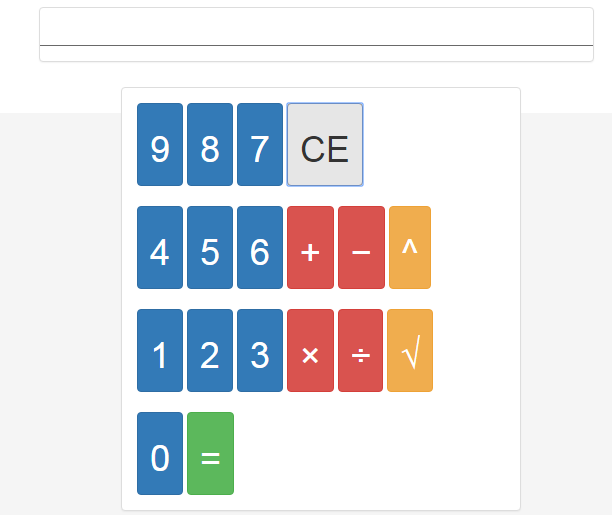

# Calculator-Basic
A calculator with basic operations powered by jQuery
 


## Live Link
 - https://wardcj1.github.io/Calculator-Basic

## Sample Code
```javascript
    $(".operator").on("click", function() {
        if (isCalculated) return;
        isOperatorChosen = true;
        operator = this.value;
        $("#operator").html($(this).text());
    });

    $(".equal").on("click", function() {
        if (isCalculated) return;
        isCalculated = true;
        firstNumber = parseInt(firstNumber);
        secondNumber = parseInt(secondNumber);
        if (operator === "plus") {
          result = firstNumber + secondNumber;
        }
        if (operator === "minus") {
          result = firstNumber - secondNumber;
        }
        if (operator === "times") {
          result = firstNumber * secondNumber;
        }
        if (operator === "divide") {
          result = firstNumber / secondNumber;
        }
        if (operator === "power") {
          result = Math.pow(firstNumber, secondNumber);
        }
        $("#result").html(result);
    });
```